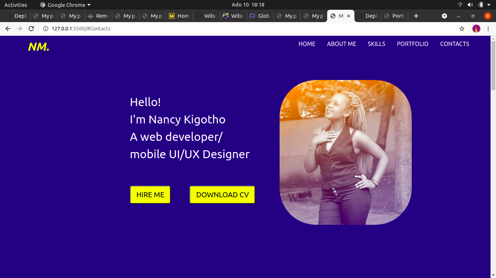
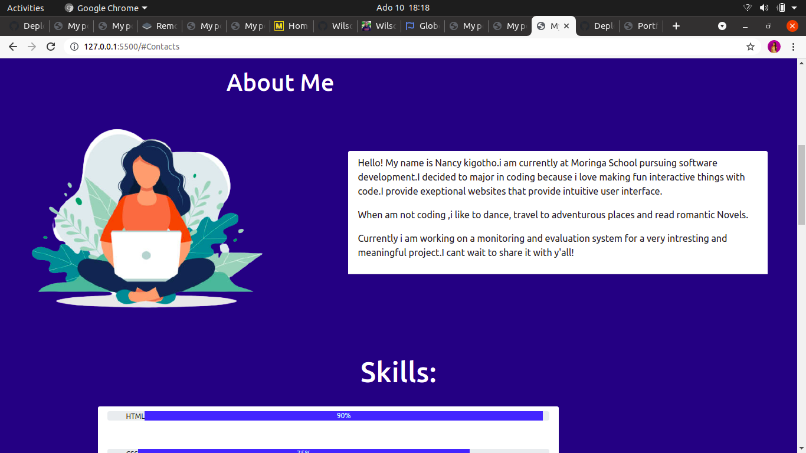
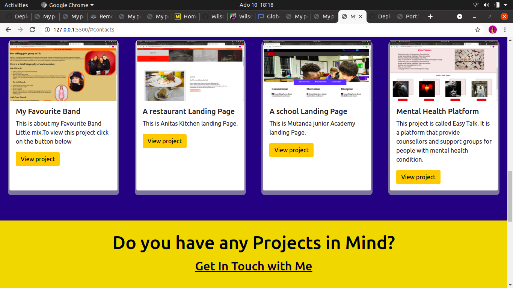
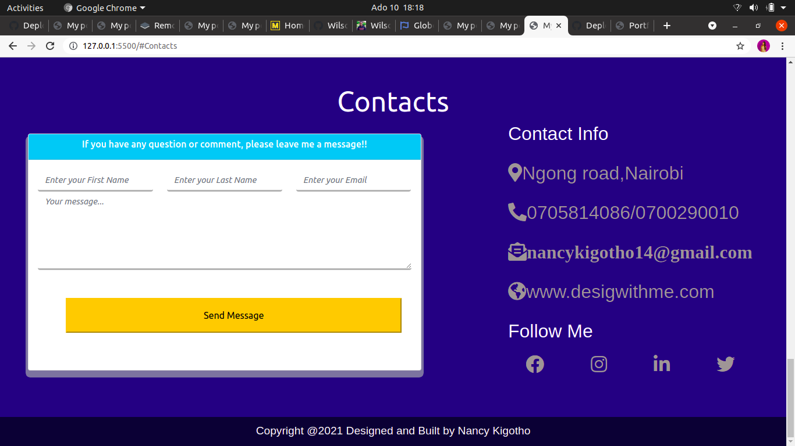

# Project Name: My Portfolio.
# Developed by: Nancy Kigotho.
# Description.
* It entails a brief about me section,the projects that i have done in the past,my skill set and lastly my contact information incase someone wants to hire me.
# Instructions
* To view the projects just click on the view project button and to see the whole project.
* incase you have any questions or comments fill in the form given and i will get back to you as soon as possible.
# Technologies Used.
* HTML.
* CSS
* Bootstrap.
# Contact Information.
If you have a project in mind or a question about my projects. Email me nancykigotho14@gmail.com.
# Requirements.
* Git
* Web browser.
* Github.
# Github Link.
* Below is a link to view my project.

https://nancymukuiya14.github.io/My-portfolio/

# Images

#  Licensing
Copyright <YEAR> <COPYRIGHT HOLDER>

Permission is hereby granted, free of charge, to any person obtaining a copy of this software and associated documentation files (the "Software"), to deal in the Software without restriction, including without limitation the rights to use, copy, modify, merge, publish, distribute, sublicense, and/or sell copies of the Software, and to permit persons to whom the Software is furnished to do so, subject to the following conditions:

The above copyright notice and this permission notice shall be included in all copies or substantial portions of the Software.

THE SOFTWARE IS PROVIDED "AS IS", WITHOUT WARRANTY OF ANY KIND, EXPRESS OR IMPLIED, INCLUDING BUT NOT LIMITED TO THE WARRANTIES OF MERCHANTABILITY, FITNESS FOR A PARTICULAR PURPOSE AND NONINFRINGEMENT. IN NO EVENT SHALL THE AUTHORS OR COPYRIGHT HOLDERS BE LIABLE FOR ANY CLAIM, DAMAGES OR OTHER LIABILITY, WHETHER IN AN ACTION OF CONTRACT, TORT OR OTHERWISE, ARISING FROM, OUT OF OR IN CONNECTION WITH THE SOFTWARE OR THE USE OR OTHER DEALINGS IN THE SOFTWARE.
